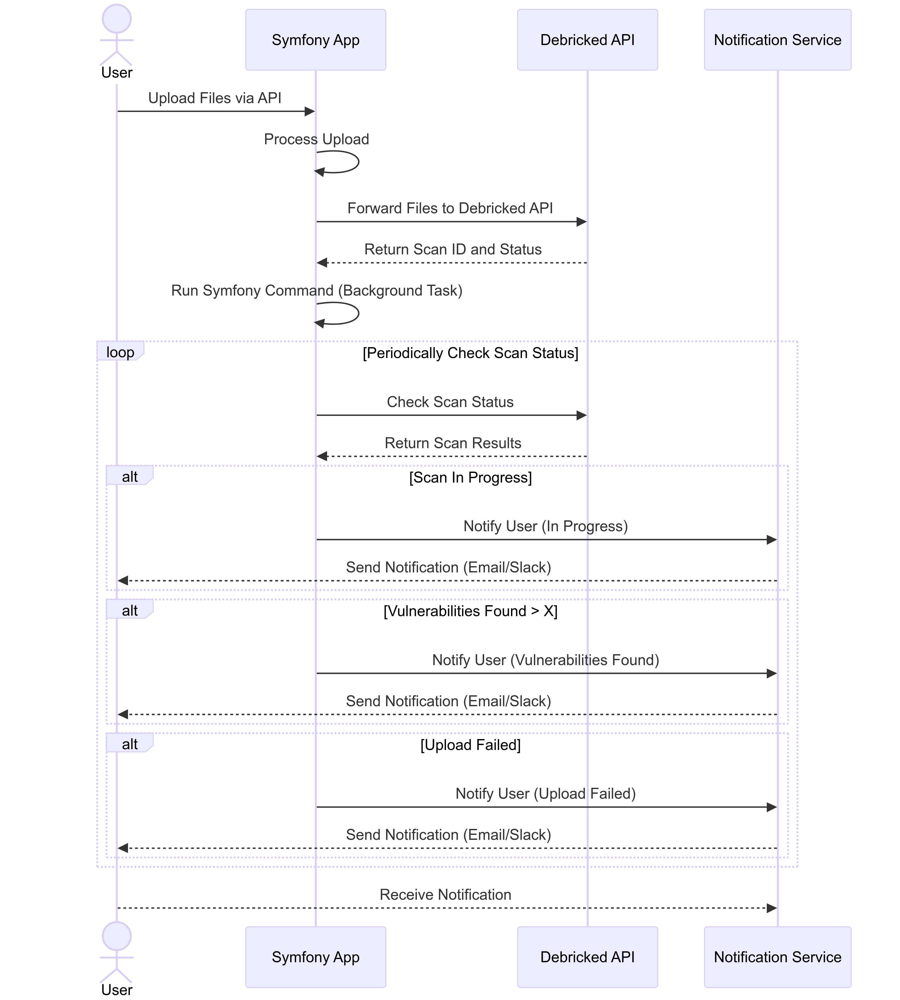
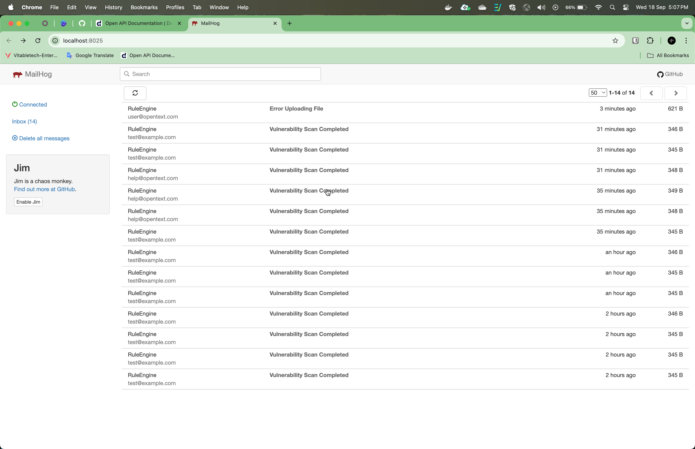
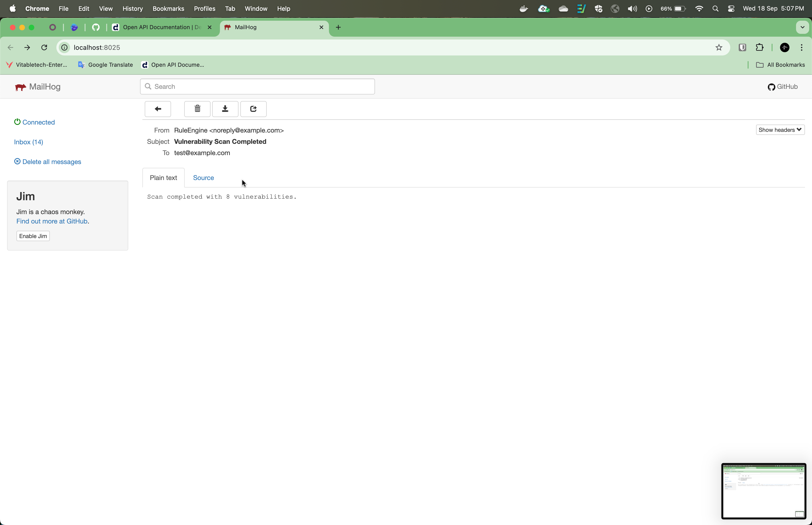
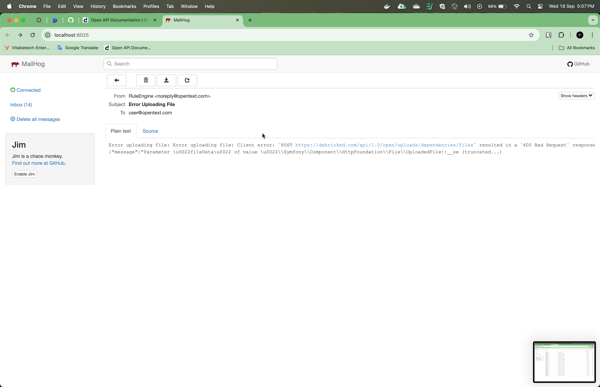

# Rule Engine

This project is a simple rule engine that allows users to upload dependency files via a REST API, forward those files to the Debricked API for scanning, and notify the user based on predefined rules. The task does not include a UI but focuses on backend operations with automated notifications and file processing.

## Features
- Upload any number of dependency files through an API.
- Forward files to Debricked's open API for scanning.
- Background command to monitor scan completion (using php artisan queue:work and Docker).
- Notify users based on predefined rules (e.g., send email for scan results, upload status, or failures).



## How to Run the Project

1. **Install Docker**  
   Make sure you have Docker installed on your machine. If not, download and install it from [here](https://www.docker.com/products/docker-desktop).

2. **Run Docker**  
   Start the Docker service on your machine.

3. **Clone the Repository**
   ```bash
   git clone https://github.com/msrajawat298/Rule-Engine.git
   ```

4. **Navigate to the Project Directory**
   ```bash
   cd Rule-Engine
   ```

5. **Start the Application**
   Run the following command to start the application using Docker Compose:
   ```bash
   docker compose up
   ```

6. **Check the Application**
   Once the containers are up and running, visit the application at:
   ```bash
   http://localhost
   ```

7. **Postman Collection**
   To interact with the API, download the Postman collection from the link below:
   [Download Postman Collection](https://api.postman.com/collections/21993237-36ae0264-c42e-4e72-8e35-192b3e0ac67b?access_key=PMAT-01J82FB6Z2RJ6WF2RD08PG38MW)

## Sample API Request

You can use the following cURL request to upload files:

```bash
curl --location 'localhost/api/upload' \
--form 'files[]=@"postman-cloud:///1ef75973-e1e7-4670-a75b-f7167b2571a7"'
```

## Sample Response

```json
{
    "message": "Files uploaded successfully, scan started",
    "ciUploadId": {
        "yarn.lock": 6315212
    }
}
```

## Checking Emails via MailHog

MailHog is used for email testing. You can access it using the following URL:
```bash
http://localhost:8025
```
Start the process to run in background
```sh
php artisan queue:work
```
```sh
php artisan queue:failed //to check is any queue failed
```

```sh
php artisan queue:listen //checking the status of queue
```

```sh
php artisan test //run the unit testing
```

```sh
 composer run-script coverage //test coverage in html format
```


## Sample Output




